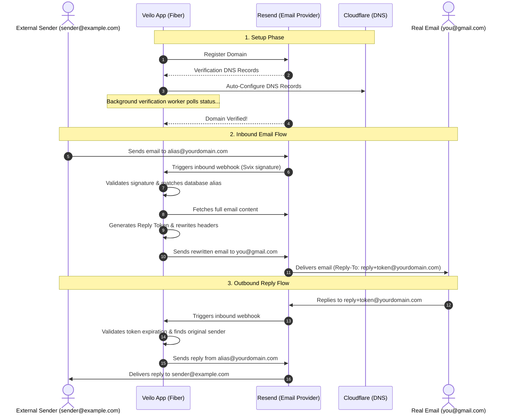

# 🥷 Veilo: The Invisible Email Shield

> **"Send, receive, and reply like a ghost."**

Veilo is a self-hosted, lightweight, lightning-fast email alias forwarding and replying engine. It allows you to create instant email aliases, automatically sets up DNS on Cloudflare, registers domains in Resend, forwards incoming messages to your real inbox, and lets you reply to them invisibly without exposing your real email address.

---

## 🚀 Key Features

*   **🎨 Creative Auto-Aliases**: Make custom aliases or let Veilo generate creative, GitHub-like repository names under 25 characters (e.g. `bouncy-valley-919@yourdomain.com`).
*   **☁️ Cloudflare Auto-DNS**: Automatic configuration of MX, TXT (SPF), and verification records for your registered domains.
*   **📨 Ghost Forwarding**: Inbound emails sent to your aliases are instantly forwarded to your real email inbox.
*   **💬 Ghost Replying**: Reply directly to any forwarded email from your personal inbox. Veilo rewrites headers and forwards it back to the original sender utilizing secure reply tokens.
*   **🕵️ Background Verification Worker**: A built-in ticker checks unverified domains against Resend's API and activates them as soon as DNS propagates.
*   **⚡ Built with Go & Fiber**: Blazing fast performance with minimal overhead.

---

## 🗺️ How it Works (Architecture)



---

## 🛠️ Getting Started

### 📋 Prerequisites

*   **Go**: 1.21 or higher.
*   **PostgreSQL**: DB host (e.g. Supabase, RDS, local pg).
*   **Resend API Key**: To handle forwarding, receiving, and verification.
*   **Cloudflare API Token**: To configure DNS records automatically.
*   **Custom Domain**: You must own a domain name to receive and reply to emails (e.g. `yourdomain.com`).
    *   *Need a cheap domain?* You can buy one (like `.xyz`, `.top`, `.icu`, `.cfd`) for as cheap as $1 - $2/year on registrars like Porkbun, Namecheap, or Cloudflare Registrar.
    *   *Want a free option?* You can register a free subdomain with full DNS control at [EU.org](https://nic.eu.org/) (e.g. `yourname.eu.org`), which can then be set up on Cloudflare. If you are a student, check out the [GitHub Student Developer Pack](https://education.github.com/pack) for a free domain from Namecheap or Name.com.


### ⚙️ Environment Variables

Create a `.env` file in the root directory (based on `.env.example`):

```ini
# Server
PORT=8084

# Database Config
DB_HOST=localhost
DB_PORT=5432
DB_USER=postgres
DB_PASSWORD=changeme
DB_NAME=veilo
DB_SSLMODE=disable

# Resend API Key
RESEND_API_KEY=re_your_resend_api_key

# Cloudflare Token (requires Zone.Zone Read, Zone.DNS Edit permissions)
CLOUDFLARE_API_TOKEN=cf_your_cloudflare_token

# Webhook URL of this server for automatically registering with Resend on startup
# e.g., https://smee.io/your-id or https://your-domain.com
WEBHOOK_URL=https://smee.io/your-unique-channel-id

# Webhook secret (Svix signing secret from Resend)
# Leave empty initially. If WEBHOOK_URL is set, Veilo will auto-create the webhook in Resend and print this secret in the logs.
WEBHOOK_SECRET=

# Global brand name used as suffix in forwarded emails (default: Veilo)
VIA_BRAND_NAME=Veilo

# Reply token TTL in days
REPLY_TOKEN_TTL_DAYS=90

# CORS & Limits
CORS_ORIGINS=*
RATE_LIMIT=60
```

### 🏃 Running locally

To run in development with hot-reload (using [Air](https://github.com/cosmtrek/air)):
```bash
air
```

To run directly with Go:
```bash
go run .
```

---

## 🔌 API Documentation

All endpoints are prefixed with `/v1`. If `API_KEY` is configured in your env, requests must include the `Authorization: Bearer <key>` header.

### 🌐 Domains

#### Register a Domain
*   **POST** `/v1/domains`
*   **Body**:
    ```json
    {
      "domain": "yourdomain.com"
    }
    ```
*   **What it does**: Registers the domain on Resend, configures MX & TXT records on Cloudflare, and registers the record in the database.

#### List Registered Domains
*   **GET** `/v1/domains`

---

### 📧 Aliases

#### Create an Alias
*   **POST** `/v1/aliases`
*   **Body** (slug, address, and display_name are optional):
    ```json
    {
      "domain": "yourdomain.com",
      "real_email": "real-inbox@gmail.com",
      "display_name": "My Custom Brand",
      "label": "My Personal Label"
    }
    ```
*   **Response** (with generated creative slug):
    ```json
    {
      "success": true,
      "message": "Alias created successfully",
      "data": {
        "id": "eb7cef51-dc5f-4052-a7b8-47a56ce77f0c",
        "address": "bouncy-valley-919@yourdomain.com",
        "slug": "bouncy-valley-919",
        "domain": "yourdomain.com",
        "real_email": "real-inbox@gmail.com",
        "display_name": "My Custom Brand",
        "label": "My Personal Label",
        "enabled": true
      }
    }
    ```

---

## 🪝 Webhook & Local Setup (Automated)

Veilo automatically manages and configures webhooks on Resend for you:

1.  **Configure Webhook URL**: In your `.env` file, set `WEBHOOK_URL` to your Smee channel (e.g. `https://smee.io/your-unique-channel-id`) or your live domain.
2.  **Start your local tunnel (if testing locally)**:
    ```bash
    smee --url https://smee.io/your-unique-channel-id --port 8084
    ```
3.  **Run Veilo**: On startup, Veilo will detect your `WEBHOOK_URL`, check if the webhook is registered, and if not, register it as a Webhook Endpoint on Resend automatically. If it creates a new webhook, it will log the generated `WEBHOOK_SECRET` (Svix signing secret):
    ```
    [Warning] Automatically configured new Resend webhook pointing to https://smee.io/your-unique-channel-id. Please copy and paste this signing secret to your .env file: WEBHOOK_SECRET=whsec_...
    ```
4.  **Update WEBHOOK_SECRET**: Copy the printed `whsec_...` value and set it as `WEBHOOK_SECRET` in your `.env` to enable secure signature validation.

---

## 🤝 Contributing Guidelines

We love contributions! To help us keep Veilo clean and high-quality:

1.  **Fork** this repository.
2.  Create a feature branch: `git checkout -b feature/cool-new-stuff`.
3.  **Run Tests**: Ensure all unit/repository tests compile and pass before pushing code:
    ```bash
    go test -count=1 ./...
    ```
4.  Commit your changes: `git commit -m 'feat: add awesome new feature'`.
5.  Push to the branch: `git push origin feature/cool-new-stuff`.
6.  Create a **Pull Request**.

---

## 📜 License

Distributed under the MIT License. See `LICENSE` for more information.
