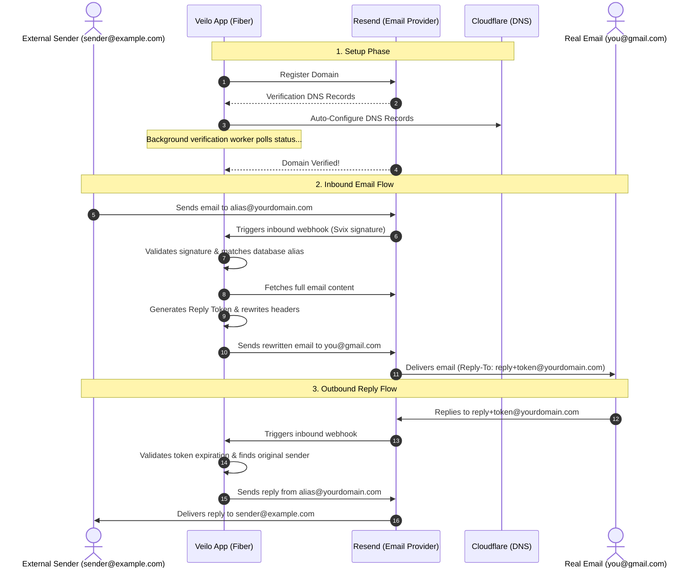

# 🥷 Veilo: The Invisible Email Shield

> **"Send, receive, and reply like a ghost."**

Veilo is a self-hosted, lightweight, lightning-fast email alias forwarding and replying engine. It allows you to create instant email aliases, automatically sets up DNS on Cloudflare, registers domains in Resend, forwards incoming messages to your real inbox, and lets you reply to them invisibly without exposing your real email address.

---

## 🚀 Key Features

*   **🎨 Creative Auto-Aliases**: Make custom aliases or let Veilo generate creative, GitHub-like repository names under 25 characters (e.g. `bouncy-valley-919@yourdomain.com`).
*   **☁️ Cloudflare Auto-DNS**: Automatic configuration of MX, TXT (SPF), and verification records for your registered domains.
*   **📨 Ghost Forwarding**: Inbound emails sent to your aliases are instantly forwarded to your real email inbox.
*   **💬 Ghost Replying**: Reply directly to any forwarded email from your personal inbox. Veilo rewrites headers and forwards it back to the original sender utilizing secure reply tokens.
*   **🕵️ Background Verification Worker**: A built-in ticker checks unverified domains against Resend's API and activates them as soon as DNS propagates.
*   **🛡️ Tracker Stripper**: Automatically strips tracking pixels (1x1 tracking images or known tracker domains like Mailchimp and Sendgrid) from incoming email HTML bodies, showing a "trackers blocked" count.
*   **⏳ Self-Destructing Aliases**: Create temporary aliases that automatically disable themselves after a friendly duration (e.g., `24h`, `7d`) or after forwarding a maximum number of emails.
*   **⚡ Built with Go & Fiber**: Blazing fast performance with minimal overhead.

---

## 🗺️ How it Works (Architecture)



---

## 🛠️ Getting Started

### 📋 Prerequisites

*   **Go**: 1.21 or higher.
*   **PostgreSQL**: DB host (e.g. Supabase, RDS, local pg).
*   **Resend API Key**: To handle forwarding, receiving, and verification.
*   **Cloudflare API Token**: To configure DNS records automatically.
*   **Custom Domain**: You must own a domain name to receive and reply to emails (e.g. `yourdomain.com`).
    *   *Need a cheap domain?* You can buy one (like `.xyz`, `.top`, `.icu`, `.cfd`) for as cheap as $1 - $2/year on registrars like Porkbun, Namecheap, or Cloudflare Registrar.
    *   *Want a free option?* You can register a free subdomain with full DNS control at [EU.org](https://nic.eu.org/) (e.g. `yourname.eu.org`), which can then be set up on Cloudflare. If you are a student, check out the [GitHub Student Developer Pack](https://education.github.com/pack) for a free domain from Namecheap or Name.com.


### ⚙️ Environment Variables

Create a `.env` file in the root directory (based on `.env.example`):

```ini
# Server
PORT=8084
APP_ENV=development # Set to "production" to enforce API_KEY check

# Security
API_KEY=your_secure_api_key # ENFORCED in production mode

# Database Config
DB_HOST=localhost
DB_PORT=5432
DB_USER=postgres
DB_PASSWORD=changeme
DB_NAME=veilo
DB_SSLMODE=disable

# Resend API Key
RESEND_API_KEY=re_your_resend_api_key

# Cloudflare Token (requires Zone.Zone Read, Zone.DNS Edit permissions)
CLOUDFLARE_API_TOKEN=cf_your_cloudflare_token

# Webhook URL of this server for automatically registering with Resend on startup
# (Leave EMPTY in production to prevent auto-creation and logging of signing secrets)
WEBHOOK_URL=https://smee.io/your-unique-channel-id

# Webhook secret (Svix signing secret from Resend)
# Manually configured on Render/Railway using the secret from Resend dashboard
WEBHOOK_SECRET=

# Global brand name used as suffix in forwarded emails (default: Veilo)
VIA_BRAND_NAME=Veilo

# Reply token TTL in days
REPLY_TOKEN_TTL_DAYS=90

# CORS & Limits
CORS_ORIGINS=*
RATE_LIMIT=60
```

#### 🔒 Production Security Rules

To run in production mode, you must explicitly set the `APP_ENV` environment variable to `production`.

In `production` mode:
1. **API Key Enforcement:** The application will fail to start if `API_KEY` is not set. All `/v1` endpoints (except the inbound webhook) will require `Authorization: Bearer <your_api_key>` headers.
2. **Webhook Security:** To prevent webhook signing secrets from being printed to production server logs on boot, you must:
   * Leave `WEBHOOK_URL` **empty** or undefined in your hosting platform (AWS, Render, Railway, etc.).
   * Manually create the webhook endpoint in the Resend Dashboard pointing to `https://yourdomain.com/webhook/inbound`.
   * Securely configure the webhook secret in the `WEBHOOK_SECRET` environment variable.

### 🏃 Running locally

To run in development with hot-reload (using [Air](https://github.com/cosmtrek/air)):
```bash
air
```

To run directly with Go:
```bash
go run .
```

---

## 💻 Command Line Interface (CLI)

Veilo includes a unified CLI to manage your email shield directly from the terminal. The single compiled binary `veilo` handles both running the server and performing client administrative commands.

### Installation & Configuration

#### Quick Install (macOS / Linux / WSL)
To download and install the latest compiled release binary automatically:
```bash
curl -sSfL https://veilo.khrees.com/install | sh
```
This command downloads the correct build for your OS and CPU architecture, makes it executable, and moves it to `/usr/local/bin`.

#### Compile from Source
To compile the binary directly from source:
```bash
go build -o veilo
```

#### Configuration

After installation, set up your Veilo CLI to connect to your own self-hosted Veilo API instance (e.g. `https://your-veilo-domain.com/v1` or local dev `http://localhost:8084/v1`), provide your API key, and configure default fallback values:
```bash
# Configure the API URL and credentials (point to your self-hosted instance)
veilo config set api-url https://your-veilo-domain.com/v1
veilo config set api-key your_api_key

# Configure your defaults for quick alias creation
veilo config set default-domain yourdomain.com
veilo config set default-email your-inbox@gmail.com
```

You can view your active configuration using:
```bash
veilo config show
```

### CLI Commands

#### Create an Alias
Create an alias with auto-generated values, or customize its properties and self-destruct limits:
```bash
# Create an alias with an auto-generated creative slug
veilo create

# Create with custom slug, domain, and real destination email
veilo create --slug custom-slug --domain yourdomain.com --email me@gmail.com

# Create an alias that expires in 24 hours (supports durations e.g., 12h, 7d, 30d, or RFC3339 timestamp)
veilo create --expires-at 24h

# Create an alias that self-destructs (auto-disables) after forwarding 5 emails
veilo create --max-forwards 5
```

#### List & Manage Aliases
```bash
# List all registered aliases
veilo list

# List only enabled aliases
veilo list --enabled

# Get specific alias details (displays expires_at, max_forwards, forwarded count)
veilo get <alias-address-or-id>

# Enable / Disable / Delete an alias
veilo enable <alias-address>
veilo disable <alias-address>
veilo delete <alias-address>
```

#### View Statistics & Logs
```bash
# View global stats (shows Total Aliases, Total Forwarded, Total Blocked, Trackers Blocked)
veilo stats

# View forward logs for an alias (shows sender, direction, status, and trackers blocked per email)
veilo logs <alias-address>
```

---

## 🔌 API Documentation

All endpoints are prefixed with `/v1`. If `API_KEY` is configured in your env, requests must include the `Authorization: Bearer <key>` header.

### 🌐 Domains

#### Register a Domain
*   **POST** `/v1/domains`
*   **Body**:
    ```json
    {
      "domain": "yourdomain.com"
    }
    ```
*   **What it does**: Registers the domain on Resend, configures MX & TXT records on Cloudflare, and registers the record in the database.

#### List Registered Domains
*   **GET** `/v1/domains`

---

### 📧 Aliases

#### Create an Alias
*   **POST** `/v1/aliases`
*   **Body** (slug, address, and display_name are optional):
    ```json
    {
      "domain": "yourdomain.com",
      "real_email": "real-inbox@gmail.com",
      "display_name": "My Custom Brand",
      "label": "My Personal Label"
    }
    ```
*   **Response** (with generated creative slug):
    ```json
    {
      "success": true,
      "message": "Alias created successfully",
      "data": {
        "id": "eb7cef51-dc5f-4052-a7b8-47a56ce77f0c",
        "address": "bouncy-valley-919@yourdomain.com",
        "slug": "bouncy-valley-919",
        "domain": "yourdomain.com",
        "real_email": "real-inbox@gmail.com",
        "display_name": "My Custom Brand",
        "label": "My Personal Label",
        "enabled": true
      }
    }
    ```

---

## 🪝 Webhook & Local Setup (Automated)

Veilo automatically manages and configures webhooks on Resend for you:

1.  **Configure Webhook URL**: In your `.env` file, set `WEBHOOK_URL` to your Smee channel (e.g. `https://smee.io/your-unique-channel-id`) or your live domain.
2.  **Start your local tunnel (if testing locally)**:
    ```bash
    smee --url https://smee.io/your-unique-channel-id --port 8084
    ```
3.  **Run Veilo**: On startup, Veilo will detect your `WEBHOOK_URL`, check if the webhook is registered, and if not, register it as a Webhook Endpoint on Resend automatically. If it creates a new webhook, it will log the generated `WEBHOOK_SECRET` (Svix signing secret):
    ```
    [Warning] Automatically configured new Resend webhook pointing to https://smee.io/your-unique-channel-id. Please copy and paste this signing secret to your .env file: WEBHOOK_SECRET=whsec_...
    ```
4.  **Update WEBHOOK_SECRET**: Copy the printed `whsec_...` value and set it as `WEBHOOK_SECRET` in your `.env` to enable secure signature validation.

---

## 🐳 Docker & Production Deployment

Veilo can be easily containerized and deployed using the provided `Dockerfile`.

### One-Click Cloud Deployment
Deploy the API and a PostgreSQL database instantly to your own account with a single click:

[](https://render.com/deploy?repo=https://github.com/khrees/veilo) &nbsp; [](https://railway.app/new/template?template=https://github.com/khrees/veilo)

### Build & Run Locally with Docker

1. Build the Docker image:
   ```bash
   docker build -t veilo .
   ```

2. Run the container:
   ```bash
   docker run -p 8084:8084 --env-file .env veilo
   ```

### Manual Cloud Deployment

If you prefer to configure the deployment manually on Railway, Render, AWS ECS, or any other container-hosting platform:
1. Connect your GitHub repository to your hosting platform.
2. Set the runtime environment to **Docker** (the platform will build automatically using the root `Dockerfile`).
3. Provision a PostgreSQL database and configure the web service connection.
4. Add the required environment variables (e.g., `DB_HOST`, `RESEND_API_KEY`, etc.) as documented in `.env.example`.

---

## 🤝 Contributing Guidelines

We love contributions! To help us keep Veilo clean and high-quality:

1.  **Fork** this repository.
2.  Create a feature branch: `git checkout -b feature/cool-new-stuff`.
3.  **Run Tests**: Ensure all unit/repository tests compile and pass before pushing code:
    ```bash
    go test -count=1 ./...
    ```
4.  Commit your changes: `git commit -m 'feat: add awesome new feature'`.
5.  Push to the branch: `git push origin feature/cool-new-stuff`.
6.  Create a **Pull Request**.

---

## 📜 License

Distributed under the MIT License. See `LICENSE` for more information.
